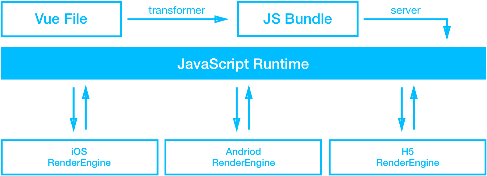

# weex入门
本demo中使用到了vue_router、js和原生通信、调用原生组件等，在使用vue_router时，发现在weex中效率表现不佳，很多坑，通过router进行页面切换会出现view闪跳以及崩溃等现象，故不建议使用router进行页面管理切换，可以使用weex_tabbar、navigator或者自己写控件。weex还在发展的道路上，但坚信混合开发是移动互联网发展的趋势，大家一起努力哈。转发需注明作者：马小鹏 marco 谢谢哈
## 简介
Weex 表面上是一个客户端技术，但实际上它串联起了从本地开发环境到云端部署和分发的整个链路。开发者首先可以在本地像撰写 web 页面一样撰写一个 app 的页面，然后编译成一段 JavaScript 代码，形成 Weex 的一个 JS bundle；在云端，开发者可以把生成的 JS bundle 部署上去，然后通过网络请求或预下发的方式传递到用户的移动应用客户端；在移动应用客户端里，WeexSDK 会准备好一个 JavaScript 引擎，并且在用户打开一个 Weex 页面时执行相应的 JS bundle，并在执行过程中产生各种命令发送到 native 端进行的界面渲染或数据存储、网络通信、调用设备功能、用户交互响应等移动应用的场景实践；同时，如果用户没有安装移动应用，他仍然可以在浏览器里打开一个相同的 web 页面，这个页面是使用相同的页面源代码，通过浏览器里的 JavaScript 引擎运行起来的。



## 安装weex-toolkit 工具
使用 npm 安装:

```
$ npm install -g weex-toolkit
```
注意：需要翻墙安装，若遇到`permission denied, open '/Users/marco/.xtoolkit/config.json"`  提示
，则`sudo chmod -R 777 /Users/marco/.xtoolkit` 再进行install即可  
不建议使用淘宝镜像安装，若使用淘宝镜像安装，可能会出现地址读取失败等问题，可以参考：`http://www.jianshu.com/p/a5e3b3709d62`
### 调试 we文件
`建议：we其实是weex想创建一套属于自己的语法而诞生的，但实际上和vue几乎一致，只是略有不同，编译效率一致，建议用vue开发，这样可以保持vue的一致性`

这个时候需要用到之前安装的 weex-toolkit 工具。

以home.we为例
直接执行命令：

```
weex home.we
```
### 转换编写的 we文件
调试没有问题后，就需要使用Weex命令转换成JS文件了。

使用命令：

```
weex home.we --output home.js
```
这个时候就会在用户根目录下见到home.js了。
### 转换vue为js android原生加载
进入vue项目根目录 输入如下命令 则会打包生成vue对应的js文件 并位于dist文件夹下 可将其拖至android assets文件夹下，通过`WXSDKInstance.render("WXSample", WXFileUtils.loadAsset("entry.js", this)）`加载显示     （./src为vue所在目录，注意entry.js即js入口文件 也要在这个目录下）

```
weex compile ./src dist
```
### Vue 与 Weex 语法差异
 v-bind:class="{'on':flag==i}"  在weex上编译不行  需改为 :class="[flag==i?'on':'']"
 weex在布局上主要为flex
 详情可参考:`http://weex.apache.org/cn/references/migration/difference.html`

### Android 扩展
Weex 提供了扩展机制，可以根据自己的业务进行定制自己的功能。
主要分为两类扩展：
#### 组件
本demo中用到了scoller、navgator、text等组件
在开发的过程中用navagator注意：

* 在js中定义：

```
  var navigator = weex.requireModule('navigator')
  var modal = weex.requireModule('modal')
  export default {
    methods: {
        toNav(event) {
            var url = 'file://assets/components/home.js'
            navigator.push({
                url: url,
                animated: "true"
            }, event => {
                modal.toast({
                    message: 'callback: ' + event
                })
            })
        }
    }
  };
```

* 需要在AndroidManifest.xml中在navigator跳转的那个activity即WXPageActivity中定义属性如下：

```
 <intent-filter>
   <action android:name="com.taobao.android.intent.action.WEEX"/>
   <category android:name="android.intent.category.DEFAULT"/>
   <category android:name="com.taobao.android.intent.category.WEEX"/>
   <action android:name="android.intent.action.VIEW"/>
   <data android:scheme="http"/>
   <data android:scheme="https"/>
   <data android:scheme="file"/>
   <data android:scheme="wxpage" />
 </intent-filter>
 ```
 
* 在WXPageActivity中通过getIntent().getExtras()获取js中传来的params 来进行逻辑封装 如本地加载js或地址加载


#### Module
Module 扩展 非 UI 的特定功能。例如 sendHttp、openURL 等。
本demo中BridgeModule实现js与native通信。
#### Component
Component 扩展 实现特别功能的 Native 控件。例如：RichTextview，RefreshListview 等。
##### 本实例中自定义了 RichText、SwitchBar等原生控件给h5调用
需注意：`public class SwitchBar extends WXComponent<Switch>`而不是`public class SwitchBar extends WXComponent`，否则不生效。
在MainApplication中进行`WXSDKEngine.registerComponent("switchBtn", SwitchBar.class)`即可在vue中`<switchBtn>`调用。
#### Adapter
Adapter 扩展 Weex 对一些基础功能实现了统一的接口，可实现这些接口来定制自己的业务。例如：图片下载等。

### Android 上遇到的坑
#### 兼容问题
本demo通过navigator实现多页面交互，所以不支持router、vuex、mixins、组件全局注册
如果单页面的话 可以使用router、vuex，但是在调试中发现weex不支持vuex中的mapActions、mapGetters等方法映射
如果需要全局方法或常量调用，可以参考本例中common/index.js   
#### 传值

* fireGlobalEventCallback

可以通过h5->native->h5等方式 也就是native作为数据传输中心，如果h5中的页面a需要发消息给上一页页面b，可以通过`weex.requireModule('bridgeModule').events(data);`先把值传给native  然后用native通过eventbus找到对应的navigator页面，再通过fireGlobalEventCallback回调信息给通过globalEvent注册的h5页面 
尝试过直接在module里直接fireGlobalEventCallback回调信息给通过globalEvent注册的h5页面，但是无论设置为异步还是同步都是不成功

* fireEvent

用于组件回调通知，如native封装的原生控件RecyclerView，当你需要设置滑动监听addScrollListener的时候，需要把监听状态返回给h5，这个时候可以用fireEvent进行事件回调，如<list>中的@scroll="scrollHandler"

#### 存储
使用weex提供的storage组件，注意因为浏览器限制了大小，需控制在5m以内，所以页面如果销毁的时候建议把对应的storage数据清除，以免造成存储空间用完。
### Weex和ReactNative对比
weex使用V8， ReactNative使用JSCore，本人当初学习react的时候，就考虑过要学react native 后来发现环境搭建配置很麻烦且一套代码无法两端运行 需要各写一套 觉得很繁琐 所以毅然选择了weex，简单易上手，且支持当下流行的轻量级vue框架。
异同地址：`https://zhuanlan.zhihu.com/p/21677103`


 
 